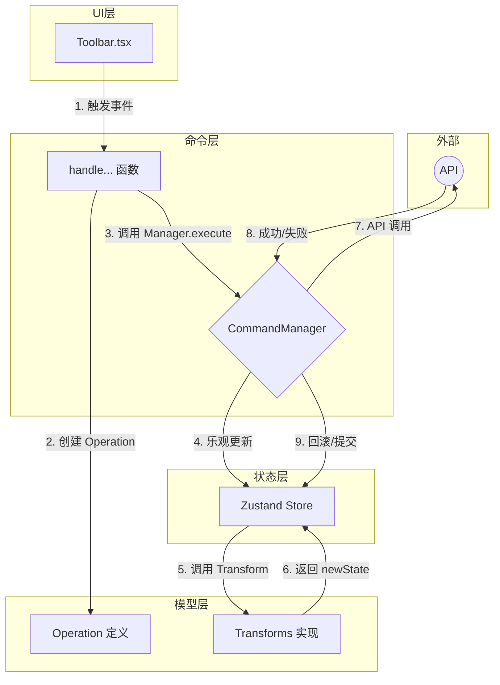

# 命令模式与分层架构前端演示

本项目是一个高级前端架构演示，旨在通过构建一个功能完备、可撤销/重做的树形编辑器，来探索和展示**命令模式 (Command Pattern)**、**分层架构 (Layered Architecture)** 以及**乐观更新 (Optimistic Updates)** 等现代前端开发中的核心设计思想。

本文档既是项目的设计说明，也可以作为技术分享的讲解材料。

## 1. 核心功能与目标

- **动态树编辑**：实现对树形结构数据的增、删、改、查以及节点位置的自由调整（上移/下移）。
- **无限制撤销/重做**：所有可逆的操作都支持无限制的撤销（Undo）和重做（Redo）。
- **异步乐观更新**：与后端 API 的交互采用乐观更新策略，即 UI 立即响应，然后发送 API 请求。
- **失败自动回滚**：当异步 API 请求失败时，系统能够自动、无感地将失败操作在 UI 上的影响回滚，保持数据状态的最终一致性。
- **高度模块化架构**：代码结构遵循“高内聚、低耦合”的原则，清晰、可扩展，易于维护。

## 2. 核心架构思想：四层分离

为了实现上述目标，我们没有采用传统的 MVC 或 MVVM 模式，而是设计了一种更符合复杂前端交互的、单向数据流的分层架构。它将一个用户操作的完整生命周期拆分为了四个独立的层次：**UI (View)**、**命令 (Command)**、**模型 (Model)** 和 **状态 (Store)**。



---

## 3. 各层职责与分工详解

我们项目的目录结构严格遵循了分层思想。下面将结合目录结构，详细解释每个模块的职责。

```
/
├── api/          # 负责与外部 API 通信
├── app/          # Next.js 页面与路由
├── commands/     # ✨ 命令层 (Command)
├── components/   # ✨ UI 层 (View)
├── model/        # ✨ 模型层 (Model)
├── public/       # 静态资源
├── store/        # ✨ 状态层 (Store)
└── types/        # 全局共享类型
```

### 3.1. `model/` - 领域模型层 (项目的“心脏”)

这是整个应用的核心，它定义了**数据是什么样的**以及**如何对数据进行最底层的原子操作**。它是一个纯粹的、与任何框架（React, Zustand）都无关的逻辑层。

-   **`model/node/node-types.ts`**: 定义了本项目的核心数据结构，如 `TreeNode` 和 `TreeState`。为了性能考虑，我们采用了**扁平化**的数据结构，通过 ID 来索引节点，实现了 O(1) 的查找效率。

-   **`model/node/operations/`**: 定义了所有可能发生的数据变更，我们称之为**操作 (Operation)**。
    -   **是什么**: 操作是一个纯粹的、可序列化的 JS 对象，它只描述“**发生了什么**”，例如 `{ type: 'add_node', ... }`。
    -   **设计原则**: 每个操作都必须是**原子性**和**可逆**的。为了实现可逆，每个操作都必须携带足够的信息来推导出其反向操作。
    -   **文件结构**: 每个操作（如 `add-node.operation.ts`）都在自己的文件中定义，最后由 `index.ts` 组合并导出一个统一的 `NodeOperation` 联合类型。`invertNodeOperation` 这个关键的反转函数也位于此。

-   **`model/node/transforms/`**: 定义了如何将一个“操作”应用到状态树上，我们称之为**变换 (Transform)**。
    -   **是什么**: 变换是一个纯函数，它接收当前状态和一个操作，返回一个全新的状态，即 `(currentState, operation) => newState`。
    -   **实现方式**: 我们使用 `Immer` 库来确保状态的不可变性，使得状态变更既安全又高效。
    -   **文件结构**: 与 `operations` 类似，每个变换逻辑（如 `add-node.transform.ts`）都在自己的文件中实现，最后由 `index.ts` 中的 `NodeTransforms.apply` 方法根据操作类型动态派发，实现了高度的可扩展性。

### 3.2. `store/` - 全局状态层

这一层使用 `Zustand` 作为状态容器，是整个应用的**唯一真实数据源 (Single Source of Truth)**。

-   **`store/index.ts`**:
    -   **职责**: 创建并导出一个全局的 `useAppStore` hook。
    -   **`applyOperation`**: 它向外暴露了一个名为 `applyOperation` 的 action。这是**外部世界改变状态的唯一入口**。该 action 接收一个操作 (Op)，并调用 `model` 层的 `NodeTransforms.apply` 来执行真正的状态变更，从而严格保证了单向数据流。

### 3.3. `commands/` - 命令处理层

这是业务逻辑的核心编排层。它处理用户意图，并管理复杂的流程，如异步请求和失败回滚。

-   **`commands/node/`**: 存放了所有具体的命令处理函数。
    -   **是什么**: 每一个文件（如 `add-node.command.ts`）都导出一个 `handle...` 函数，它代表一个具体的用户意图，例如“处理添加节点这个动作”。
    -   **职责**:
        1.  从 UI 层接收用户输入（如 `parentId`, `newName`）。
        2.  根据输入，创建一个标准化的**操作 (Operation)** 对象。
        3.  将这个操作对象交给 `CommandManager` 去执行。

-   **`commands/manager.ts`**: 这是命令模式的核心——`CommandManager`。
    -   **职责**:
        1.  管理一个 `history` 栈和一个 `redoStack` 栈，以实现撤销/重做。
        2.  提供 `execute`, `undo`, `redo` 三个核心方法。
        3.  **编排异步流程**: `execute` 方法是实现“乐观更新”和“自动回滚”的关键。它会先立即调用 `store` 的 `applyOperation` 更新 UI，然后执行异步 API 调用。如果 API 成功，则将操作计入历史；如果 API 失败，则自动生成一个反向操作，再次调用 `applyOperation` 来回滚状态。

### 3.4. `components/` - UI 视图层

这一层负责界面的渲染和用户输入的捕获。它由纯粹的 React 组件构成。

-   **职责**: 当用户进行操作时（例如点击“添加”按钮），UI 组件会调用 `commands/node/` 中对应的 `handle...` 函数来触发一个命令，同时传递必要的参数（如从 `store` 中获取的 `selectedNodeId`）。
-   **设计原则**: UI 层非常“薄”，它不包含任何业务逻辑。它只知道“发生了什么用户事件”，然后去调用相应的命令处理器，它不关心这个命令是如何被执行的。

### 3.5. `api/` & `types/`

-   **`api/`**: 封装了所有与外部世界的通信逻辑。在本项目中，它通过 `mockSuccessApi` 和 `mockFailureApi` 来模拟真实的异步网络请求。
-   **`types/`**: 存放项目中跨模块共享的、非领域核心的 TypeScript 类型定义，例如 `ApiFunction`。

## 4. 总结：清晰的数据流

当用户点击“更新名称（API成功）”按钮时，整个应用的数据流如下：

1.  **`Toolbar.tsx` (UI层)**: `onClick` 事件触发，调用 `handleUpdateNodeName('node-1', '新名称', mockSuccessApi)`。
2.  **`update-node.command.ts` (命令层)**: `handleUpdateNodeName` 创建一个 `{ type: 'update_node', ... }` 的操作对象。
3.  **`manager.ts` (命令层)**: `commandManager.execute` 方法被调用。
    -   它立即调用 `store.applyOperation(操作)`。
4.  **`store/index.ts` (状态层)**: `applyOperation` 调用 `NodeTransforms.apply(当前状态, 操作)`。
5.  **`transforms/` (模型层)**: `update-node.transform.ts` 中的逻辑被执行，返回一个**新状态**。UI 响应式更新。
6.  **`manager.ts` (命令层)**: `execute` 方法接着 `await mockSuccessApi(操作)`。
7.  **`api/index.ts`**: 模拟 API 请求成功。
8.  **`manager.ts` (命令层)**: API 成功后，将该操作推入 `history` 栈，以便后续撤销。

这个流程清晰地展示了各层如何只做自己的事，并通过定义好的接口进行协作，最终形成了一个健壮、可预测且易于扩展的系统。
